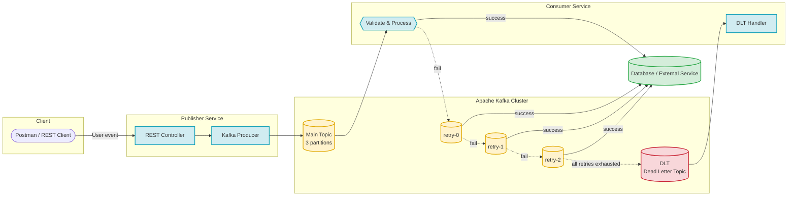
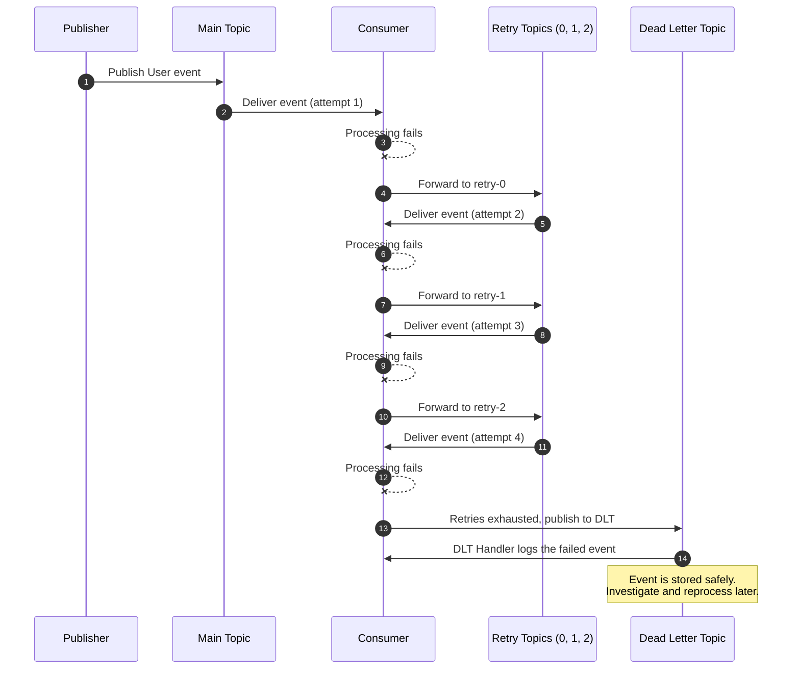
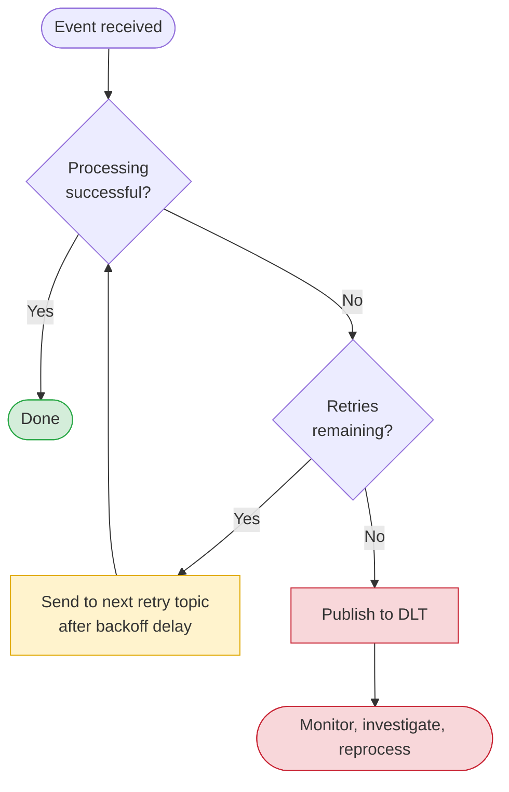
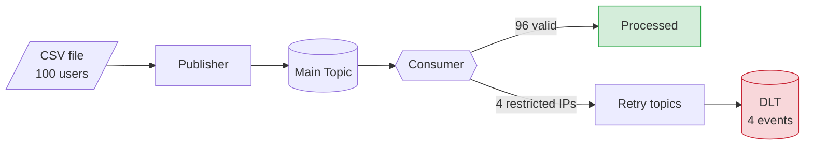

# Kafka Error Handling
### Reliable Message Processing with Retry Topics & Dead Letter Topic (DLT)

*A hands-on Spring Boot project showing how to handle consumer failures in Apache Kafka without losing a single event.*

---

## Table of Contents

1. [Overview](#1-overview)
2. [The Problem](#2-the-problem)
3. [The Solution](#3-the-solution)
4. [Architecture](#4-architecture)
5. [Processing Flow](#5-processing-flow)
6. [Topics Created Automatically](#6-topics-created-automatically)
7. [Project Structure](#7-project-structure)
8. [Getting Started](#8-getting-started)
9. [Test Scenarios](#9-test-scenarios)
10. [Advanced Configuration](#10-advanced-configuration)
11. [Bulk Processing Demo](#11-bulk-processing-demo)
12. [Key Takeaways](#12-key-takeaways)

---

## 1. Overview

This project is a practical demonstration of error handling in **Apache Kafka** using **Spring Boot**. It simulates a failure inside a consumer and shows how the system recovers by retrying the event and, if it still fails, safely storing it in a **Dead Letter Topic** for later investigation and reprocessing.

**What you will learn**

- Why unhandled consumer errors lead to data loss
- How to retry failed events using non-blocking retry topics
- How to route permanently failed events to a Dead Letter Topic
- How to tune retry behavior (attempts, delays, excluded exceptions)
- How to verify the behavior with a bulk load of 100 events

---

## 2. The Problem

Kafka runs in a distributed way across multiple machines or containers. While a consumer processes an event, something can go wrong: a database connection drops, an external service such as AWS S3 is unavailable, or another infrastructure issue appears.

If the consumer simply throws an exception and moves on, **the event is lost forever**. In critical domains such as financial transactions, this is unacceptable.

| Without error handling | With retry + DLT |
|---|---|
| Failed event is dropped | Failed event is retried automatically |
| No trace of what failed | Permanent failures are stored in the DLT |
| Data loss on temporary outages | Data is preserved and can be reprocessed |

---

## 3. The Solution

The strategy has two layers:

1. **Retry:** when processing fails, Kafka re-attempts the event a configured number of times, each time through a dedicated retry topic.
2. **Dead Letter Topic (DLT):** when every attempt is exhausted, the event is moved to a separate topic that holds all permanently failed events, so nothing is lost and everything can be monitored.

> **Note on attempt count:** the configured value includes the original attempt. Setting it to 4 means 1 original attempt plus **3 retries**. The default is 3.

---

## 4. Architecture

---

## 5. Processing Flow

The sequence below shows what happens to a single event that keeps failing until it reaches the DLT.

**Decision logic**

---

## 6. Topics Created Automatically

With 4 attempts configured, Kafka creates the following topics without any manual setup:

| Topic | Role |
|---|---|
| Main topic | Receives all new events (created with 3 partitions) |
| Main topic + `-retry-0` | First retry attempt |
| Main topic + `-retry-1` | Second retry attempt |
| Main topic + `-retry-2` | Third retry attempt |
| Main topic + `-dlt` | Final destination for events that failed every attempt |

> The DLT only receives **failed** events. Successfully processed events never reach the retry topics or the DLT.

---

## 7. Project Structure

The repository contains two Spring Boot services:

| Module | Responsibility |
|---|---|
| **Publisher** | Exposes a REST endpoint, accepts a `User` payload, and publishes it to Kafka. Can also load a CSV of users and publish them in bulk. |
| **Consumer** | Listens to the main topic, validates each event, and handles retry and DLT logic. |

**`User` model**

| Field | Description |
|---|---|
| `id` | Unique identifier |
| `firstName` | First name |
| `lastName` | Last name |
| `email` | Email address |
| `gender` | Gender |
| `ipAddress` | Client IP, used for the simulated validation |

**Failure simulation:** the consumer holds a list of restricted IP addresses. When an incoming user has one of those IPs, the consumer raises an exception. This stands in for a real-world failure such as a database or AWS outage.

---

## 8. Getting Started

**Prerequisites**

- JDK 17 or later
- Maven
- Apache Kafka and ZooKeeper (local installation)
- Postman or any REST client
- Offset Explorer (optional, for visualizing topics and messages)

**Run order**

1. Start **ZooKeeper**
2. Start the **Kafka** server
3. (Optional) Connect **Offset Explorer** to the local cluster
4. Start the **Consumer** service
5. Start the **Publisher** service

On startup, the main topic is created with three partitions, and the retry and DLT topics are created automatically. You can confirm this in the application logs and in Offset Explorer.

---

## 9. Test Scenarios

| # | Scenario | Input | Expected Result |
|---|---|---|---|
| 1 | Happy path | User with a valid IP | Event is published and consumed successfully. No retries, nothing in the DLT. |
| 2 | Failure without handling | User with a restricted IP (before adding retry and DLT) | Consumer throws an exception and the event is lost. |
| 3 | Failure with retry and DLT | User with a restricted IP (after adding retry and DLT) | Event fails, goes through `retry-0`, `retry-1`, `retry-2`, then lands in the DLT. |
| 4 | Mixed valid and invalid events | Several valid users followed by one invalid user | Only the invalid event appears in the DLT. Valid ones are processed normally. |

**How to verify scenario 3**

- **Application logs:** each attempt logs the topic name, so you can see the event arriving from the main topic and then from each retry topic in order.
- **Offset Explorer:** open each retry topic and the DLT to see the same event stored in every stage.

---

## 10. Advanced Configuration

### Backoff between retries

By default, retries happen back to back. A backoff policy adds a delay between attempts and can grow exponentially.

| Setting | Example | Meaning |
|---|---|---|
| Delay | 3000 ms | Wait 3 seconds before the first retry |
| Multiplier | 1.5 | Each delay is 1.5 times the previous one |
| Max delay | 15000 ms | The delay never exceeds 15 seconds |

### Excluding exceptions from retry

Some errors are not worth retrying, for example a null pointer caused by malformed data. Such exceptions can be excluded so the event goes **straight to the DLT** without wasting attempts.

> In this demo the simulated failure is a runtime exception, so it must **not** be excluded if you want to observe the retry behavior.

### Number of attempts

| Attempts configured | Original attempt | Retries | Retry topics created |
|---|---|---|---|
| 3 (default) | 1 | 2 | 2 |
| 4 | 1 | 3 | 3 |
| 5 | 1 | 4 | 4 |

---

## 11. Bulk Processing Demo

To validate the behavior at scale, the publisher loads a **CSV file with 100 users**, converts it to a list of user objects, and publishes them one by one.

| Metric | Value |
|---|---|
| Total events published | 100 |
| Restricted IPs configured in the consumer | 4 (taken from the same CSV) |
| Events processed normally | 96 |
| Events sent to the DLT | 4 |

**Verification:** the consumer logs show four DLT messages, and the DLT topic in Offset Explorer contains four new records, matching the restricted IPs.

---

## 12. Key Takeaways

- Never let a failed event silently disappear. Retry it first.
- Retries run through dedicated topics, so a failing event does not block the rest of the stream.
- Events that still fail after all retries are preserved in the Dead Letter Topic.
- Kafka creates the retry and DLT topics automatically.
- Backoff and exception exclusion let you tune the behavior to your use case.
- The DLT gives you a safe place to monitor, investigate, and reprocess failures.

---

**Based on the Java Techie tutorial on Kafka error handling with retry and DLT.**

